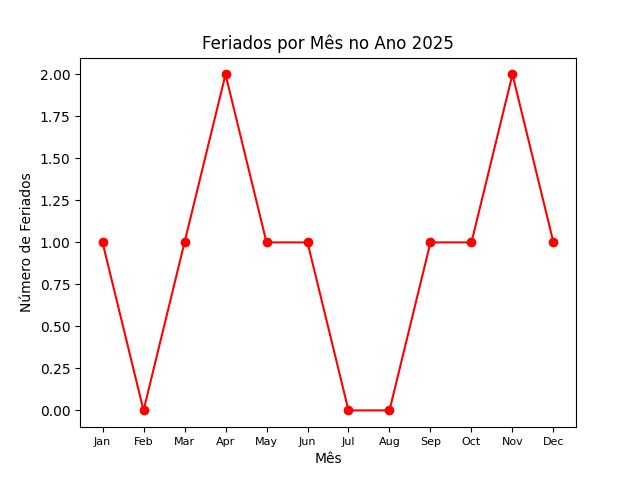

<div><h1>Calendário de Feriados 2025</h1>
<p>Este repositório contém um script em Python que calcula e gera um gráfico com o número de feriados por mês no Brasil para o ano de 2025. O script inclui feriados fixos e móveis, como Carnaval, Sexta-feira Santa e Corpus Christi.</br></p>

<h5>📋 Requisitos</h5>
<p>Python 3.8 ou superior</p>
Bibliotecas necessárias:
`matplotlib`
`holidays`
`dateutil`

Para instalar as dependências, use: ```bash pip install matplotlib holidays python-dateutil ```

<h5>📊 Funcionalidades</h5>
Calcula todos os feriados nacionais brasileiros.
Considera feriados móveis como Carnaval, Sexta-feira Santa e Corpus Christi.
Gera um gráfico de linha exibindo o número de feriados por mês

<h5>🖼️ Exemplo do Gráfico</h5>
O gráfico exibe o número de feriados distribuídos pelos meses do ano de 2025.

<h5>🚀 Contribuições</h5>
Contribuições são bem-vindas! Abra uma issue ou envie um pull request.

<h5>📜 Licença</h5>
Este projeto está licenciado sob a MIT License. EOF

<div align="center">

</div>


